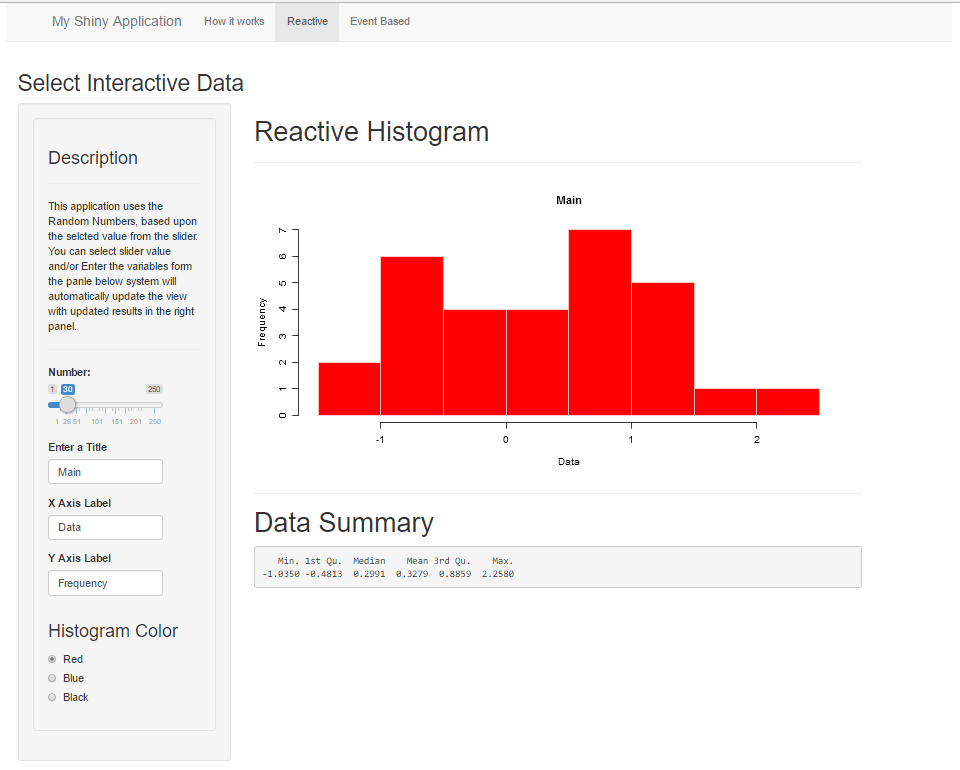
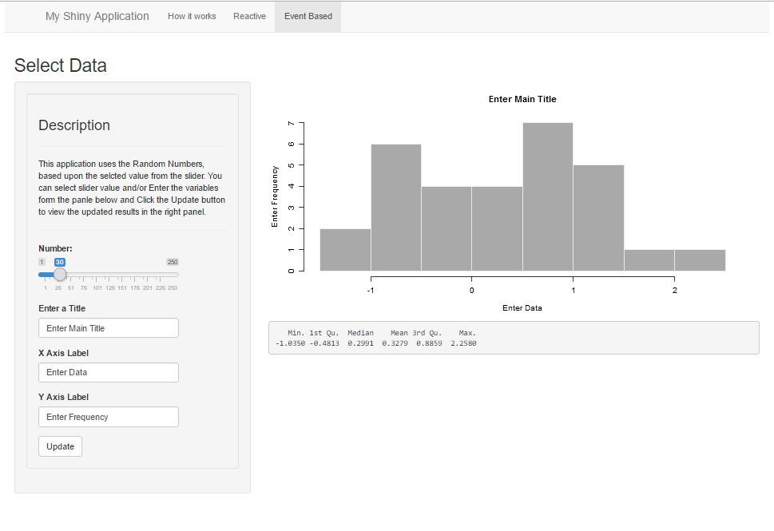

```{r setup, include=FALSE}
knitr::opts_chunk$set(echo = FALSE)
```

## Instructions

This peer assessed assignment is for the "Developing Data Products" Class. There are two parts.

1. Create a Shiny application and deploy it on Rstudio's servers. 
2. Use Slidify or Rstudio Presenter to prepare a reproducible pitch presentation about your application

More information abuot this can be found at [Developing Data Products](https://www.coursera.org/learn/data-products/peer/tMYrn/course-project-shiny-application-and-reproducible-pitch)


## The Shiny Application 

The Shiny application created for this assignment is using random numbers from normal distribution

```{r echo=TRUE}
  set.seed(7575)
  data <- rnorm(50)
  summary(data)

```

More information about the normal distibution can be found by visiting [Normal Distribution](https://stat.ethz.ch/R-manual/R-devel/library/stats/html/Normal.html) link

## The Shiny Application (Contd 1 ...)


[Go to Application](https://prabhjot75.shinyapps.io/myfirstshinyapplication/)



## The Shiny Application (Contd 2 ...)



## The Reproducible Pitch Presentation

This presentation, is the second part of the assignment, and it prepared using  Slidy Presentation and R RStudio, and is published to the RPubs website.

[Web link of this presentation](http://rpubs.com/prabhjot75/ddpslidypresentstion)

